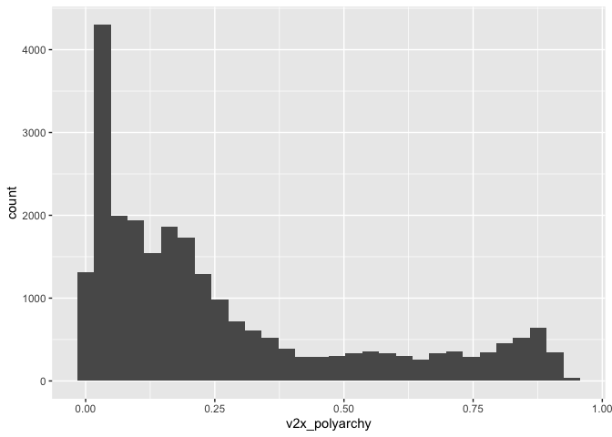
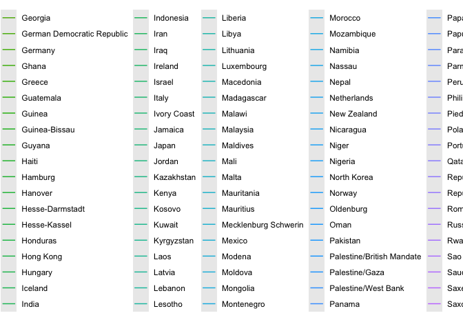
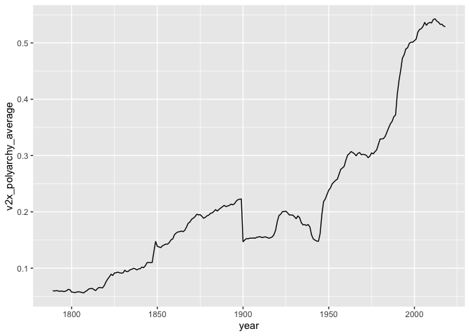
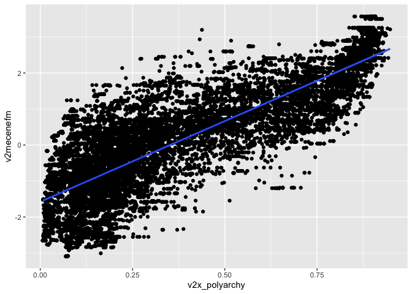
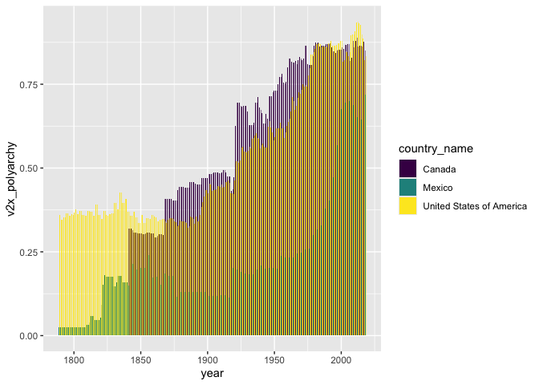

[R
Script](https://www.dropbox.com/scl/fi/51ru0k8p2gove2bl9iylf/workshop2.Rmd?rlkey=hjxvje7lgqvy5hpsn24bxap72&dl=0){:
.btn–research}

[V-Dem Dataset
(v9)](https://www.dropbox.com/scl/fi/0oioskebzm75q0bzdnwxk/V-Dem-Dataset.csv?rlkey=k9so4ygzoenan627aq00x4c3y&dl=0){:
.btn–research} [V-Dem Dataset
Codebook](https://www.dropbox.com/scl/fi/ffeimy5337k79x3t1frx2/V-Dem-Codebook-v9.pdf?rlkey=fmqxn3dsbjru8ag2oburlqklx&dl=0){:
.btn–research}

<!--more-->

  

Coppedge, Michael, John Gerring, Carl Henrik Knutsen, Staffan I.
Lindberg, Jan Teorell, David Altman, Michael Bernhard, M. Steven Fish,
Adam Glynn, Allen Hicken, Anna Lührmann, Kyle L. Marquardt, Kelly
McMann, Pamela Paxton, Daniel Pemstein, Brigitte Seim, Rachel Sigman,
Svend-Erik Skaaning, Jeffrey Staton, Agnes Cornell, Lisa Gastaldi,
Haakon Gjerløw, Valeriya Mechkova, Johannes von Römer, Aksel Sundtröm,
Eitan Tzelgov, Luca Uberti, Yi-tingWang, Tore Wig, and Daniel Ziblatt.
2019. “V-Dem Codebook v9” Varieties of Democracy (V-Dem) Project.

## Load data

``` r
library(here)
```

    ## here() starts at /Users/ericthai/Library/CloudStorage/Dropbox/Website

``` r
library(readr)
library(tidyverse)
```

    ## ── Attaching core tidyverse packages ──────────────────────── tidyverse 2.0.0 ──
    ## ✔ dplyr     1.1.4     ✔ purrr     1.0.2
    ## ✔ forcats   1.0.0     ✔ stringr   1.5.1
    ## ✔ ggplot2   3.5.1     ✔ tibble    3.2.1
    ## ✔ lubridate 1.9.3     ✔ tidyr     1.3.1

    ## ── Conflicts ────────────────────────────────────────── tidyverse_conflicts() ──
    ## ✖ dplyr::filter() masks stats::filter()
    ## ✖ dplyr::lag()    masks stats::lag()
    ## ℹ Use the conflicted package (<http://conflicted.r-lib.org/>) to force all conflicts to become errors

``` r
library(haven)

vdem<- read_csv("~/Dropbox/Teaching/SS2_2024_POLI144AB/Data/V-Dem Dataset.csv")
```

    ## Rows: 26834 Columns: 1730
    ## ── Column specification ────────────────────────────────────────────────────────
    ## Delimiter: ","
    ## chr     (3): country_name, country_text_id, histname
    ## dbl  (1726): country_id, year, project, historical, codingstart, codingend, ...
    ## date    (1): historical_date
    ## 
    ## ℹ Use `spec()` to retrieve the full column specification for this data.
    ## ℹ Specify the column types or set `show_col_types = FALSE` to quiet this message.

## Select our variables

``` r
vdem_cleaned <- vdem %>% 
  select(country_name, year, v2x_polyarchy, v2mecenefm) 
```

## Histogram

``` r
vdem_cleaned %>%
  ggplot(aes(x = v2x_polyarchy)) +
  geom_histogram()
```

    ## `stat_bin()` using `bins = 30`. Pick better value with `binwidth`.

    ## Warning: Removed 1839 rows containing non-finite outside the scale range
    ## (`stat_bin()`).

<!-- -->

``` r
vdem_cleaned %>%
  ggplot(aes(x = year, y = v2x_polyarchy, color = country_name)) +
  geom_line() +
  theme(legend = "none")
```

    ## Warning in plot_theme(plot): The `legend` theme element is not defined in the
    ## element hierarchy.

    ## Warning: Removed 1646 rows containing missing values or values outside the scale range
    ## (`geom_line()`).

<!-- -->

``` r
vdem_cleaned %>%
  group_by(year) %>%
  summarise(v2x_polyarchy_average = mean(v2x_polyarchy, na.rm = TRUE)) %>%
  ggplot(aes(x = year, y = v2x_polyarchy_average)) +
  geom_line()
```

<!-- -->

## Scatterplot

``` r
vdem_cleaned %>%
  ggplot(aes(x = v2x_polyarchy, y = v2mecenefm)) +
  geom_point() +
  geom_smooth(method = "lm")
```

    ## `geom_smooth()` using formula = 'y ~ x'

    ## Warning: Removed 8524 rows containing non-finite outside the scale range
    ## (`stat_smooth()`).

    ## Warning: Removed 8524 rows containing missing values or values outside the scale range
    ## (`geom_point()`).

<!-- -->

``` r
lm(v2mecenefm ~ v2x_polyarchy,
   data = vdem_cleaned)
```

    ## 
    ## Call:
    ## lm(formula = v2mecenefm ~ v2x_polyarchy, data = vdem_cleaned)
    ## 
    ## Coefficients:
    ##   (Intercept)  v2x_polyarchy  
    ##        -1.575          4.479

``` r
-1.575 + 4.479
```

    ## [1] 2.904

``` r
vdem_global_mean <- vdem_cleaned %>%
  group_by(year) %>%
  summarise(v2x_polyarchy = mean(v2x_polyarchy, na.rm = TRUE)) %>%
  mutate(country_name = "Global")

vdem_cleaned %>%
  filter(country_name == "United States of America") %>%
  select(-v2mecenefm) %>%
  bind_rows(vdem_global_mean) %>%
  ggplot(aes(x = year, y = v2x_polyarchy, color = country_name)) +
  geom_line() +
  labs(x = "Year",
       y = "V-Dem Polyarchy",
       color = "Country",
       title = "Polyarchy Trends over Time (US vs Global)")
```

<!-- -->

``` r
vdem_cleaned %>%
  filter(country_name %in% c("United States of America", "Mexico", "Canada")) %>%
  select(-v2mecenefm) %>%
  ggplot(aes(x = year, y = v2x_polyarchy, fill = country_name)) +
  geom_col(position = "dodge") +
  scale_fill_viridis_d()
```

<!-- -->

``` r
library(plotly)
```

    ## 
    ## Attaching package: 'plotly'

    ## The following object is masked from 'package:ggplot2':
    ## 
    ##     last_plot

    ## The following object is masked from 'package:stats':
    ## 
    ##     filter

    ## The following object is masked from 'package:graphics':
    ## 
    ##     layout

``` r
piechart_data = vdem_cleaned %>%
  filter(country_name %in% c("United States of America", "Mexico", "Canada") & year == 2000) 


plot_ly(piechart_data, labels = ~country_name, values = ~v2x_polyarchy, type = "pie", marker = list(colors = c("#F23030", "#267365", "#F28705")) )
```

<div class="plotly html-widget html-fill-item" id="htmlwidget-ab1fc9dccd39d1e15553" style="width:672px;height:480px;"></div>
<script type="application/json" data-for="htmlwidget-ab1fc9dccd39d1e15553">{"x":{"visdat":{"14f7a7b07b699":["function () ","plotlyVisDat"]},"cur_data":"14f7a7b07b699","attrs":{"14f7a7b07b699":{"labels":{},"values":{},"marker":{"colors":["#F23030","#267365","#F28705"]},"alpha_stroke":1,"sizes":[10,100],"spans":[1,20],"type":"pie"}},"layout":{"margin":{"b":40,"l":60,"t":25,"r":10},"hovermode":"closest","showlegend":true},"source":"A","config":{"modeBarButtonsToAdd":["hoverclosest","hovercompare"],"showSendToCloud":false},"data":[{"labels":["Canada","Mexico","United States of America"],"values":[0.85399999999999998,0.67700000000000005,0.88],"marker":{"color":"rgba(31,119,180,1)","colors":["#F23030","#267365","#F28705"],"line":{"color":"rgba(255,255,255,1)"}},"type":"pie","frame":null}],"highlight":{"on":"plotly_click","persistent":false,"dynamic":false,"selectize":false,"opacityDim":0.20000000000000001,"selected":{"opacity":1},"debounce":0},"shinyEvents":["plotly_hover","plotly_click","plotly_selected","plotly_relayout","plotly_brushed","plotly_brushing","plotly_clickannotation","plotly_doubleclick","plotly_deselect","plotly_afterplot","plotly_sunburstclick"],"base_url":"https://plot.ly"},"evals":[],"jsHooks":[]}</script>
